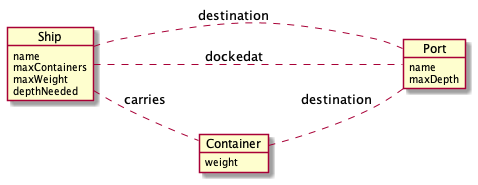
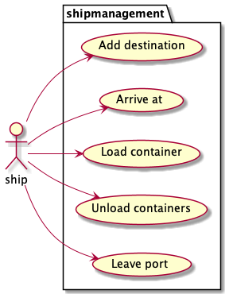
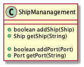

# Containerships

We have been hired to build a system that keeps track of container ships and their cargo.

A container ship has a certain size which is expressed in terms of number of containers, the ship
can carry. A container ship also has a maximum weight with which it can be loaded. Containers weight
can vary enormously, depending on what is stored inside. A container ship also has a minimum depth it
needs for a port to be able to dock at that port.
Each container ship has an ordered list of ports it will visit. The ship will only accept port with an adequate depth. Upon arrival at a port, the ship can unload all the containers destines for that port.
While docked at a port, the ship can load new containers, but only containers destined for one of the ports the ship will be visiting will be accepted. If you try to load a container unto the ship which is destined for a port the ship is not visiting, it will be rejected.

A ship is either in port or in route to a port.

A team of bussines it consultants has analysed the needs of the customer and has arrived at the following domain diagram.
  

In our world we only deal with ships, ports and containers.
  
The ship has the following use cases 

A port can be added to the ship as a destination. It will then be the last port of call (until another port is added)  
A ship can arrive at a port. The port will then be the port the ship is docked at and containers for that port can be unloaded.  
When a ship is docked in a port containers can be loaded upon the ship. Only containers destined for one of the ports the ship is visiting can be added to the ship.  
A ship can leave the port, at that moment no containers can be loaded upon the ship, until the ship reaches its destination.  

## Design the system
We first design a system on "paper".
Start by creating a class diagram. 
You can use paper, a graphic tool like [Draw.io](https://app.diagrams.net/),
[Visual paradigm onlin](https://online.visual-paradigm.com/)
or a text based tool line [plantuml](https://plantuml.com/) to do this.

## Build the system.
Use the class diagram as youre starting point and implement the system.

## Storing state
We have created the classes which define the type of objects needed for our system.
Now we need some way to access all the objects in our system.
We will create a ship management system class to do this for us.

The class we are going to use for this will look like this:

Other developers can the use this class to access the objects in our system.

After you have implemented the system the code wich has been commented out in the Main class should work without any problems.

