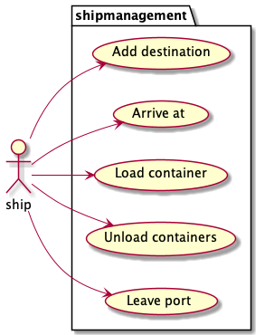
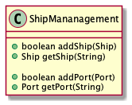

# Containerships

Wij zijn ingehuurd om een systeem te bouwen dat containerschepen en hun lading bijhoudt.

Een containerschip heeft een bepaalde grootte die wordt uitgedrukt in het aantal containers, dat het schip
kan vervoeren. Een containerschip heeft ook een maximum gewicht waarmee het geladen kan worden. Het gewicht van containers
kan enorm variëren, afhankelijk van wat erin is opgeslagen. Een containerschip heeft ook een minimumdiepte die het
nodig heeft om in een haven te kunnen aanmeren.
Elk containerschip heeft een geordende lijst van havens die het zal aandoen. Het schip zal alleen havens accepteren met een voldoende diepte. 
Bij aankomst in een haven kan het schip alle containers lossen die voor die haven bestemd zijn.
Terwijl het schip in een haven ligt, kan het nieuwe containers laden, maar alleen containers die bestemd zijn 
voor een van de havens die het schip zal bezoeken, worden geaccepteerd. Als u een container probeert te 
laden die bestemd is voor een haven die het schip niet aandoet, zal deze worden geweigerd.

Een schip is ofwel in de haven of op weg naar een haven.

Een team van bussines it-consultants heeft de behoeften van de klant geanalyseerd en is tot het volgende domeindiagram gekomen.

In our world we only deal with ships, ports and containers.
  
Het schip heeft de volgende use cases 

Een haven kan aan het schip worden toegevoegd als bestemming. Het zal dan de laatste aanloophaven zijn (totdat een andere haven wordt toegevoegd)  
Een schip kan in een haven aankomen. De haven is dan de haven waar het schip is afgemeerd en containers voor die haven kunnen worden gelost.  
Wanneer een schip in een haven is afgemeerd, kunnen containers op het schip worden geladen. Only containers destined for one of the ports the ship is visiting can be added to the ship.  
Een schip kan de haven verlaten, op dat moment kunnen er geen containers op het schip worden geladen, totdat het schip zijn bestemming heeft bereikt.

## Ontwerp system
We ontwerpen eerst een systeem op "papier".
Begin met het maken van een klassendiagram.
Je kunt papier gebruiken, een grafisch hulpmiddel zoals [Draw.io](https://app.diagrams.net/),
[Visual paradigm onlin](https://online.visual-paradigm.com/)
of een tekst-gebaseerde tool lijn [plantuml](https://plantuml.com/) om dit te doen.

## Bouw het system.
Gebruik het klassendiagram als uitgangspunt en implementeer het systeem.

## De toestand opslaan
We hebben de klassen gecreëerd die het type objecten definiëren dat nodig is voor ons systeem.
Nu hebben we een manier nodig om toegang te krijgen tot alle objecten in ons systeem.
We zullen een ship management system class creëren om dit voor ons te doen.

De klasse die we hiervoor gaan gebruiken ziet er als volgt uit:

Andere ontwikkelaars kunnen deze klasse gebruiken om toegang te krijgen tot de objecten in ons systeem.

Nadat je het systeem hebt geïmplementeerd zou de code die is uitgecommentarieerd in de Hoofdklasse zonder problemen moeten werken.

